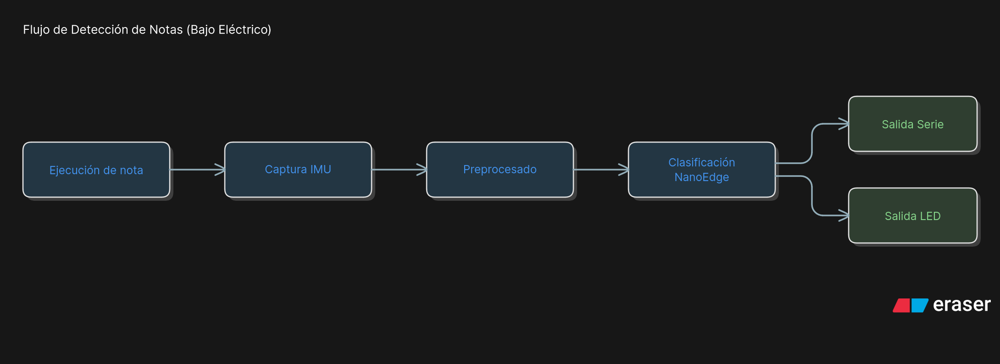

# aiBass

---

## Portada


- Título del TFG: **aiBass**
- Autor: **Alfonso Espadero García**
- Convocatoria: **mayo de 2026**
- Tutor: **Ángel Jiménez Fernández**
- Cotutor: **Daniel Casanueva Morato**
- Titulación: **Ingeniería Informática. Ingeniería de Computadores**
- Universidad/Centro: **Universidad de Sevilla**
- Departamento: **Arquitectura y Tecnología de Computadores**

---

## Dedicatoria

Dedicado a

---

## Agradecimientos

Quiero agradecer a mi tutor, Ángel Jiménez Fernández por renovar en mí las ganas que tenía el día que entré por las puertas de este centro por primera vez.

---

## Resumen

El proyecto **aiBass** plantea un sistema de inteligencia artificial embebida orientado a la detección de notas musicales en bajo eléctrico a partir de información inercial. La idea principal es aprovechar las vibraciones asociadas a la ejecución del instrumento, capturarlas mediante una IMU y procesarlas en una plataforma embebida para estimar, en tiempo real, la nota que está sonando.

El enfoque del trabajo combina instrumentación física, adquisición de datos, tratamiento de señal e inferencia de un modelo de clasificación en un entorno con restricciones de recursos. Esto sitúa el proyecto en la intersección entre sistemas empotrados, aprendizaje automático aplicado y tecnología musical.

En el estado actual de desarrollo se ha logrado detectar cinco clases de salida: las cuatro notas fundamentales del bajo (**E, A, D, G**) y una clase de **ruido/silencio** (ausencia de nota válida), mostrando el resultado por interfaz serie. Durante el desarrollo se evaluaron diferentes ubicaciones del sensor: una primera etapa con colocación en el mástil ofreció baja fiabilidad, por lo que el prototipado evolucionó hacia una configuración de prueba con el sensor sobre el amplificador.

A nivel de arquitectura software, el firmware se ha reorganizado para incluir **FreeRTOS**, dejando una base más escalable para incorporar funcionalidades futuras sin reestructuraciones profundas. También se exploró una salida de afinación en **centésimas**, pero la solución actual basada en NanoEdge opera como clasificador discreto de categorías y no proporciona una estimación continua de desviación tonal.

Una parte relevante del trabajo se dedicó a estudiar la viabilidad de un enfoque alternativo de firmware en **Rust con Embassy**. Esta línea consumió aproximadamente **100 horas** y finalmente se descartó por no aportar, en este momento del proyecto, una relación coste/beneficio favorable respecto al objetivo de completar un prototipo funcional. El desarrollo total considerado en la memoria se sitúa en torno a **300 horas**.

El documento describe la motivación del problema, el estado del arte, las tecnologías utilizadas, la arquitectura general, el desarrollo técnico por bloques, el plan de pruebas y la planificación del proyecto, incluyendo una estimación de costes. Finalmente, se recogen conclusiones, limitaciones actuales y posibles líneas de trabajo futuro para mejorar robustez, generalización y aplicabilidad práctica.

Palabras clave: IA embebida, STM32, Afinador, Detección de notas, FreeRTOS

---

## Abstract

The **aiBass** project proposes an embedded artificial intelligence system for musical note detection in electric bass using inertial data. The main idea is to exploit instrument vibrations, capture them through an IMU, and process them on an embedded platform to estimate, in real time, which note is being played.

The project combines hardware instrumentation, data acquisition, signal processing, and embedded inference under resource constraints. Therefore, it lies at the intersection of embedded systems, applied machine learning, and music technology.

At the current development stage, the system can detect five output classes: the four fundamental bass notes (**E, A, D, G**) and a **noise/silence** class (no valid note sounding), with results printed through a serial interface. During development, different sensor locations were tested: an initial neck-mounted setup provided low reliability, so the prototype evolved to a test setup with the sensor placed on top of the amplifier.

From a software architecture perspective, the firmware now includes **FreeRTOS**, creating a cleaner foundation for adding future features. A cents-level tuning output was also explored, but the current NanoEdge-based solution is limited to **discrete signal categorization** and does not provide continuous pitch deviation estimation.

A significant development phase focused on assessing a firmware approach in **Rust with Embassy**. This line of work took approximately **100 hours** and was eventually dropped, as it did not provide the best cost/benefit ratio for delivering the current prototype scope. The total effort considered in this report is approximately **300 hours**.

This report presents the project motivation, state of the art, employed technologies, overall architecture, technical development by modules, testing approach, and project planning, including cost estimation. Finally, conclusions, current limitations, and future work are discussed to improve robustness, generalization, and practical applicability.

Keywords: Embedded AI, STM32, Tuner, Note detection, FreeRTOS

---

## Índice

Se genera automáticamente al aplicar estilos de encabezado en Google Docs/Word.

---

## Índice de figuras

Se genera automáticamente en Google Docs/Word una vez insertadas y tituladas todas las figuras.

---

## Objetivos del proyecto

### Objetivos técnicos/profesionales

1. Diseñar una solución de detección de notas en bajo basada en señales inerciales.
2. Implementar una cadena completa desde captura de datos hasta inferencia embebida.
3. Construir y gestionar un conjunto de datos representativo de las clases objetivo.
4. Desarrollar un clasificador capaz de distinguir **E, A, D, G** y **ruido/silencio**.
5. Integrar una salida de resultado en tiempo real mediante interfaz serie.
6. Analizar el comportamiento del sistema ante cambios de montaje y condiciones de medida.
7. Estructurar el firmware sobre **FreeRTOS** para facilitar ampliaciones funcionales futuras.

#### Desarrollo de los objetivos técnicos/profesionales

**1) Diseñar una solución de detección de notas en bajo basada en señales inerciales.**  
Este objetivo define la aportación principal del trabajo: abordar un problema musical clásico con una vía de captura distinta a la habitual basada en audio. El diseño de la solución no se limitó a seleccionar un sensor, sino a estructurar una propuesta completa que incluyera hipótesis de medida, estrategia de validación y criterios de decisión para iterar cuando los resultados no fueran estables.

**2) Implementar una cadena completa desde captura de datos hasta inferencia embebida.**  
La meta no era obtener un modelo aislado en un entorno de laboratorio, sino cerrar el ciclo extremo a extremo dentro del propio sistema embebido. Esto exigió coordinar adquisición, preprocesado, llamada a la librería de clasificación y publicación del resultado en tiempo real, manteniendo coherencia entre todas las etapas y evitando soluciones parciales difíciles de defender en una memoria técnica.

**3) Construir y gestionar un conjunto de datos representativo de las clases objetivo.**  
La calidad del dataset condiciona de forma directa la utilidad del clasificador, por lo que se planteó como un objetivo explícito y no como una tarea secundaria. Se buscó capturar muestras con suficiente variabilidad para evitar sobreajuste a una sesión concreta, manteniendo además un etiquetado coherente que permitiera iterar el entrenamiento sin degradar trazabilidad.

**4) Desarrollar un clasificador capaz de distinguir E, A, D, G y ruido/silencio.**  
Este objetivo concreta el alcance funcional del prototipo y permite medir el progreso de forma objetiva. Incluir la clase de ruido/silencio fue clave para acercar el comportamiento a una situación real de uso, donde no siempre existe una nota válida y el sistema debe ser capaz de discriminar reposo, ruido ambiental o ejecución no interpretable.

**5) Integrar una salida de resultado en tiempo real mediante interfaz serie.**  
La salida serie se planteó como interfaz mínima viable para depuración y validación del sistema durante el desarrollo. Aunque no es una interfaz final para usuario, proporciona observabilidad inmediata, permite registrar secuencias de clasificación y facilita la comparación entre versiones de firmware, cambios de montaje y ajustes de modelo.

**6) Analizar el comportamiento del sistema ante cambios de montaje y condiciones de medida.**  
La experiencia del proyecto confirmó que el rendimiento depende tanto del modelo como del contexto físico de captura. Este objetivo obliga a tratar el sistema como un conjunto integrado hardware-software, documentando cómo afectan la fijación del sensor, la forma de ejecución y la repetibilidad entre sesiones a la estabilidad de la salida.

**7) Estructurar el firmware sobre FreeRTOS para facilitar ampliaciones funcionales futuras.**  
Más allá de resolver el prototipo actual, se buscó dejar una base de ingeniería mantenible para futuras iteraciones. La adopción de FreeRTOS permite desacoplar responsabilidades entre tareas, reducir dependencias cruzadas y preparar el proyecto para incorporar nuevas funcionalidades sin rehacer la arquitectura desde cero.

### Objetivos formativos/educacionales

1. Profundizar en sistemas embebidos orientados a IA en el borde (edge AI).
2. Aprender metodologías de adquisición de datos para clasificación supervisada.
3. Consolidar competencias de validación experimental y análisis de resultados.
4. Practicar integración HW/SW en un contexto realista de prototipado.
5. Mejorar la capacidad de toma de decisiones técnicas ante resultados no ideales.
6. Evaluar y descartar de forma justificada alternativas tecnológicas cuando no encajan en alcance/plazo (caso Rust + Embassy).

#### Desarrollo de los objetivos formativos/educacionales

**1) Profundizar en sistemas embebidos orientados a IA en el borde (edge AI).**  
El proyecto ha servido para trabajar con restricciones reales de memoria, latencia e integración periférica, que suelen quedar fuera de ejercicios puramente académicos. Esta experiencia ha consolidado una visión práctica de la IA embebida como disciplina de compromiso entre precisión, coste computacional y mantenibilidad.

**2) Aprender metodologías de adquisición de datos para clasificación supervisada.**  
Una parte central del aprendizaje fue diseñar cómo capturar datos útiles y no solo cómo entrenar con ellos. Definir protocolos repetibles, criterios de etiquetado y mecanismos de control básico de calidad permitió entender que, en muchos casos, el cuello de botella de un sistema inteligente no está en el algoritmo, sino en la fase de datos.

**3) Consolidar competencias de validación experimental y análisis de resultados.**  
La validación se abordó como proceso iterativo, comparando escenarios, analizando errores y revisando decisiones de diseño en función de evidencia experimental. Este enfoque fortaleció la capacidad para interpretar resultados con criterio técnico y comunicar limitaciones de forma honesta dentro del alcance de un prototipo.

**4) Practicar integración HW/SW en un contexto realista de prototipado.**  
La implementación obligó a coordinar sensores, firmware, planificación de tareas y canal de salida, reproduciendo problemas típicos de proyectos embebidos reales. Esta integración ha reforzado habilidades transversales de depuración, instrumentación y estructuración modular del software.

**5) Mejorar la capacidad de toma de decisiones técnicas ante resultados no ideales.**  
El proyecto incluyó decisiones de cambio de rumbo relevantes, como revisar la ubicación del sensor o acotar funcionalidades para priorizar robustez. Aprender a abandonar opciones poco viables, incluso cuando eran técnicamente atractivas, ha sido uno de los aprendizajes de ingeniería más importantes del TFG.

**6) Evaluar y descartar de forma justificada alternativas tecnológicas cuando no encajan en alcance/plazo (caso Rust + Embassy).**  
La fase de exploración en Rust + Embassy aportó valor formativo incluso sin materializarse en la versión final del firmware. Permitió comparar ecosistemas, identificar costes de integración y fundamentar una decisión de descarte basada en alcance, calendario y riesgo técnico, no en preferencias personales.

---

## Introducción

La digitalización de instrumentos musicales ha estado tradicionalmente ligada a captadores electromagnéticos, sistemas de análisis de audio o dispositivos externos de procesado. En paralelo, la evolución de los sensores MEMS y del cómputo embebido ha abierto una alternativa interesante: inferir información musical a partir de vibraciones y movimiento, reduciendo la dependencia de cadenas de audio convencionales.

El bajo eléctrico, por su función rítmica y armónica, ofrece un escenario atractivo para este tipo de aproximación. La posibilidad de identificar automáticamente la nota ejecutada puede habilitar aplicaciones de apoyo al aprendizaje, afinación asistida, control de efectos o interfaces MIDI no convencionales. Sin embargo, trasladar esta idea a un sistema práctico exige resolver varios retos: adquisición robusta, ruido, variabilidad de ejecución y restricciones de memoria/cómputo en el dispositivo objetivo.

Este proyecto aborda el problema desde una perspectiva aplicada. En lugar de centrarse únicamente en el entrenamiento de un modelo, se desarrolla una cadena completa que incluye decisiones de montaje físico del sensor, diseño del flujo de datos, clasificación y visualización de salida. El interés académico y profesional reside precisamente en esa integración de disciplinas.

Desde la óptica de ingeniería, aiBass se plantea como un caso de estudio de diseño iterativo en sistemas ciberfísicos de bajo coste. El objetivo no es únicamente "hacer funcionar un clasificador", sino construir una solución defendible donde cada decisión tenga trazabilidad técnica: por qué se selecciona una plataforma concreta, cómo se justifica un protocolo de captura, qué compromisos se aceptan entre complejidad y robustez, y qué límites funcionales se reconocen explícitamente para no sobredimensionar conclusiones.

También es relevante destacar que la propuesta se sitúa en un espacio intermedio entre investigación y prototipado aplicado. No se persigue competir directamente con afinadores comerciales especializados, sino demostrar la viabilidad de una ruta alternativa basada en señal inercial para abrir nuevas posibilidades de interacción musical en contextos educativos y de experimentación técnica.

Además, el proyecto tiene una dimensión iterativa: los resultados experimentales han condicionado decisiones clave del diseño. La comparación entre la colocación inicial del sensor en el mástil y configuraciones posteriores ilustra que el rendimiento final no depende solo del algoritmo, sino del sistema completo (instrumento, entorno, montaje y procesamiento).

Desde una perspectiva social y tecnológica, iniciativas como aiBass se enmarcan en una tendencia de democratización de herramientas inteligentes para creación musical. Un sistema de este tipo puede evolucionar hacia soluciones de asistencia en práctica instrumental, accesibilidad o interacción hombre-máquina en escenarios de bajo coste.

Finalmente, esta memoria adopta una visión deliberadamente crítica de los resultados: se describen logros funcionales, pero también se documentan fronteras de validez, condiciones bajo las que el sistema pierde estabilidad y decisiones de alcance que se han tomado para priorizar consistencia técnica. Esta forma de presentación pretende facilitar una evaluación académica rigurosa y, al mismo tiempo, servir de base realista para una evolución posterior del proyecto.

**Figura 1. Contexto del proyecto y flujo general de uso.**  
Insertar un diagrama simple con el flujo: *ejecución de nota* -> *captura IMU* -> *preprocesado* -> *clasificación NanoEdge* -> *salida serie*.



La motivación personal del proyecto nace de combinar dos intereses: sistemas embebidos y práctica musical real. El objetivo no era construir solo una demo de IA, sino comprobar hasta qué punto una solución de bajo coste podía ofrecer utilidad práctica para un bajista en sesiones de estudio y validación técnica.

También ha sido un trabajo de aprendizaje orientado a la toma de decisiones de ingeniería. Parte de la dificultad estuvo en aceptar cambios de rumbo cuando los resultados no eran suficientemente estables (ubicación del sensor, alcance de la salida musical y arquitectura de firmware), priorizando una base técnica sólida sobre una solución aparentemente más completa pero menos fiable.

---

## Estado del arte

### Objetivo del apartado

El objetivo de este apartado es situar aiBass frente a soluciones existentes y trabajos relacionados para justificar, con criterio técnico, tanto su enfoque como su alcance. No se trata solo de listar referencias, sino de identificar qué problemas están bien resueltos en la literatura y en producto comercial, y qué hueco concreto aborda este proyecto.

### Sistemas de detección de nota basados en audio

Los enfoques clásicos de detección de nota en instrumentos de cuerda suelen apoyarse en señal de audio. Estos sistemas aprovechan técnicas como análisis espectral, autocorrelación o modelos de aprendizaje sobre características acústicas. Su principal ventaja es la cercanía con la magnitud física directamente perceptible (frecuencia/pitch). Como limitación, pueden verse afectados por ruido ambiental, latencia de procesamiento y dependencia de una cadena de captación adecuada.

**Pros**:
- Madurez tecnológica y amplia bibliografía.
- Alta interpretabilidad en términos de frecuencia fundamental.

**Contras**:
- Sensibles al entorno acústico.
- Integración embebida condicionada por coste computacional y de captura.

Como referencias representativas dentro de este enfoque pueden citarse el trabajo de **Madero Ayora (2024)** sobre afinación digital embebida y la documentación técnica/comercial de afinadores de audio en tiempo real como **PolyTune 3 (TC Electronic, s. f.)**.

En conjunto, estas propuestas muestran que la vía acústica dispone de una madurez muy superior en producto final y experiencia de usuario. Sin embargo, también evidencian una dependencia fuerte de la cadena de audio y del entorno sonoro. Esa dependencia es precisamente la motivación para explorar en aiBass una ruta complementaria: aprovechar información mecánica local mediante IMU para reducir, en ciertos escenarios, la sensibilidad al entorno acústico externo.

### Afinadores y soluciones comerciales de ayuda al instrumentista

Existen múltiples dispositivos orientados a afinación o asistencia musical. Aunque no todos realizan clasificación de nota con el mismo objetivo que aiBass, su análisis permite comparar precisión, experiencia de usuario y viabilidad de producto.

**Producto A — TC Electronic PolyTune 3 (pedal afinador, ~95 EUR)**  
Pros: detección rápida, formato pedal robusto para directo, referencia de mercado consolidada.  
Contras: no ofrece análisis inercial ni integración experimental con pipeline IA embebido.

**Producto B — Peterson StroboStomp HD (pedal afinador estroboscópico, ~149 EUR)**  
Pros: muy alta precisión en afinación, lectura estable, configurable para distintos instrumentos.  
Contras: coste superior y enfoque cerrado como afinador, no como plataforma de investigación.

**Producto C — Fender Tune (app móvil, gratuita con opciones premium)**  
Pros: accesibilidad alta, sin hardware dedicado y útil para aprendizaje inicial.  
Contras: dependencia del micrófono/entorno acústico y menor control sobre condiciones de medida.

La comparativa comercial resulta útil para fijar expectativas de producto, pero también para delimitar honestamente el alcance del TFG. Mientras que los productos consolidados optimizan experiencia final y estabilidad en múltiples contextos de uso, aiBass centra su valor en la exploración técnica de una arquitectura alternativa embebida. Por ello, la comparación debe leerse más como análisis de referencia que como comparación directa de prestaciones finales.

### Interfaces MIDI para guitarra/bajo

Los captadores y convertidores MIDI constituyen una familia relevante de referencia. Suelen buscar traducción de la interpretación a eventos musicales discretos, aunque la tecnología de captura puede diferir (hexafónica, audio digital, etc.).

Comparativamente, aiBass explora una vía alternativa basada en IMU, con potencial en simplicidad mecánica de integración y coste, a cambio de retos adicionales en robustez de clasificación.

Como referencias de esta categoría destacan soluciones como **Fishman TriplePlay** (captación orientada a control MIDI) y sistemas de pastilla/controlador como **Roland GK**, que convierten interpretación instrumental en eventos discretos para síntesis o producción.

La principal enseñanza para aiBass de esta familia de soluciones es que la traducción de interpretación instrumental a eventos discretos es una necesidad real con aplicaciones inmediatas. Aun cuando la tecnología de captura difiere, el paralelismo conceptual con la clasificación de clases musicales en tiempo real permite plantear una futura integración de salida MIDI como evolución natural del prototipo.

### Sistemas basados en sensores inerciales (IMU) aplicados a música

Como referencia cercana en el dominio musical, puede citarse el TFG de **Madero Ayora (2024)** sobre un afinador electrónico embebido. Aunque comparte el objetivo de apoyo al instrumentista, su enfoque técnico se basa en una cadena diferente a aiBass, por lo que sirve como antecedente de contexto más que como réplica metodológica directa.

Entre los trabajos centrados explícitamente en IMU aplicadas a interpretación musical, **Freire et al. (2020)** evalúan la captura de gestos de rasgueo de guitarra con sensores inerciales frente a captura óptica de movimiento. Este trabajo aporta una validación experimental sólida de la utilidad de la IMU en tareas musicales reales, aunque su foco principal es la caracterización del gesto y no la clasificación de notas discretas.

En la línea de aprendizaje automático sobre datos de movimiento musical, **Dalmazzo y Ramírez (2019)** proponen la clasificación de gestos de arco en violín. El valor de este antecedente para aiBass está en demostrar que la señal gestual wearable puede transformarse en categorías interpretativas útiles mediante modelos de clasificación, si bien el problema objetivo difiere del reconocimiento de notas fundamentales en bajo.

De forma complementaria, **Provenzale et al. (2021)** estudian la técnica de arco en violinistas principiantes combinando MIMU y sensores de proximidad. Su contribución principal es metodológica: evidencian que la sensórica de bajo coste puede usarse para evaluación técnica y feedback, lo que refuerza la viabilidad de sistemas de asistencia musical basados en movimiento.

En síntesis, el estado del arte revisado confirma que las IMU son una tecnología válida para análisis musical y entrenamiento instrumental, pero deja menos cubierto el caso específico de **clasificación embebida de notas de bajo** en tiempo real. Precisamente ahí se sitúa la aportación de aiBass.

Además, la revisión realizada permite identificar una brecha metodológica concreta: muchos trabajos con IMU en música se enfocan en gesto, postura o técnica, mientras que la identificación de nota en bajo exige una discriminación de clases con fronteras más estrechas y mayor sensibilidad a variaciones de ejecución. Esta diferencia justifica que aiBass dedique tanto esfuerzo a protocolo de captura, montaje físico y consistencia temporal de las ventanas de entrada.

### Aportación diferencial de aiBass

Frente al estado del arte revisado, aiBass aporta:

1. Integración de clasificación de notas fundamentales usando una cadena embebida.
2. Validación práctica del impacto del posicionamiento del sensor.
3. Prototipo funcional con salida en tiempo real por puerto serie.
4. Base para evolución hacia aplicaciones de afinación y/o interfaz tipo MIDI.
5. Base software desacoplada mediante **FreeRTOS** para crecimiento funcional del sistema.
6. Identificación explícita de la limitación actual: la clasificación discreta de NanoEdge no permite afinación en centésimas.

| Solución | Tipo de captura | Salida principal | Resolución tonal | Coste aproximado | Aportación frente a aiBass |
|---|---|---|---|---:|---|
| Afinadores por audio (pedal/app) | Audio | Nota/afinación | Alta (incluye cents) | 0-150 EUR | Muy útiles en afinación clásica, pero no exploran vía inercial |
| Interfaces MIDI comerciales | Pastilla/audio especializado | MIDI | Discreta por evento | 150-450 EUR | Enfoque musical potente, mayor complejidad/coste |
| Trabajos IMU musicales (literatura) | IMU wearable | Gesto/técnica | Discreta (gesto) | N/A | Validan IMU en música, no se centran en afinación |
| **aiBass** | **IMU integrada (LSM6DSL)** | **Clase de nota por serie** | **Discreta (E/A/D/G/ruido)** | **~50 EUR hardware base** | **Prototipo embebido de bajo coste con arquitectura ampliable (FreeRTOS)** |

Esta comparación no pretende afirmar superioridad global de aiBass frente a soluciones comerciales o académicas consolidadas. Su función es situar con precisión la contribución del proyecto: demostrar viabilidad técnica de una cadena embebida inercial para clasificación de notas fundamentales, con coste de entrada reducido y una arquitectura software preparada para crecimiento funcional.

---

## Tecnologías Empleadas

### Objetivo del apartado

Este apartado describe las tecnologías seleccionadas y, sobre todo, la razón de su elección dentro del contexto del TFG. La intención es dejar clara la relación entre requisitos del proyecto, capacidades de cada componente y decisiones de arquitectura tomadas durante el desarrollo.

### Plataforma embebida principal

La plataforma principal de desarrollo es el **Discovery kit B-L4S5I-IOT01A**, basado en el microcontrolador **STM32L4S5VIT6** (familia STM32L4+, núcleo Arm Cortex-M4). Esta placa integra recursos suficientes para un prototipo de IA embebida y, al mismo tiempo, mantiene un enfoque de bajo consumo.

Desde el punto de vista práctico, su elección encaja muy bien con el alcance del TFG por tres motivos: integra sensórica directamente en placa (incluida la IMU LSM6DSL), dispone de herramientas de depuración y programación integradas (ST-LINK) y permite iterar rápido en firmware sin depender de hardware externo adicional.

Características destacables para este trabajo:

1. Microcontrolador STM32L4S5VIT6 con **2 MB de Flash** y **640 KB de RAM**.
2. Sensores integrados en la placa, incluyendo IMU, útiles para pruebas iniciales y validación rápida.
3. Conectividad y expansión (USB, cabeceras, conectores de expansión), que facilitan pruebas y evolución del prototipo.
4. Ecosistema software maduro (STM32Cube y documentación oficial), adecuado para desarrollo académico.

Desde el punto de vista de viabilidad de TFG, la elección de esta plataforma también reduce riesgo de integración, ya que combina disponibilidad de ejemplos, soporte comunitario y documentación oficial extensa. Esto permitió dedicar más esfuerzo a la parte diferencial del proyecto (captura inercial y clasificación) en lugar de consumir tiempo en problemas de arranque de plataforma.


### Sensor inercial

La IMU empleada es la **LSM6DSL**, un módulo inercial de 6 ejes (acelerómetro 3D + giroscopio 3D). Para este proyecto resulta especialmente adecuada por su equilibrio entre prestaciones, consumo y disponibilidad dentro del propio kit de desarrollo.

De acuerdo con la documentación del fabricante, el sensor permite:

1. Rangos de aceleración de **±2/±4/±8/±16 g**.
2. Rangos de velocidad angular de **±125/±245/±500/±1000/±2000 dps**.
3. Operación en modo de altas prestaciones con consumo reducido (orden de mA bajo).
4. Funciones orientadas a adquisición continua y almacenamiento por lotes para análisis temporal.

En aiBass, la LSM6DSL actúa como fuente principal de señal para construir ventanas temporales que posteriormente se clasifican en las clases musicales objetivo.

Otro aspecto clave es la repetibilidad de medida. Al integrarse en la propia placa, la IMU reduce variabilidad introducida por cableado y electrónica externa, lo que simplifica la fase de prototipado temprano. Aunque esta integración no elimina por sí sola la variabilidad física del montaje, sí aporta una base de adquisición estable para comparar iteraciones de firmware y modelo.

### Firmware y herramientas de desarrollo

El desarrollo firmware se ha apoyado en el ecosistema STM32 para configurar periféricos, adquirir señal inercial y publicar resultados por serie. En términos funcionales, el firmware implementa tres bloques: captura de muestras IMU, preparación de entrada para inferencia y envío de etiqueta de clase detectada.

Como cambio relevante de arquitectura, se ha incorporado **FreeRTOS** para separar responsabilidades en tareas y simplificar la incorporación de nuevas funcionalidades (por ejemplo, nuevas salidas, comunicaciones o lógica de postprocesado) manteniendo una base más mantenible.

Herramientas y componentes de trabajo empleados:

1. Entorno STM32 para configuración y compilación del proyecto embebido.
2. Drivers/periféricos para lectura del sensor inercial y comunicación UART.
3. Flujo de depuración iterativo con salida serie para validación del comportamiento en tiempo real.

Además, el proyecto incorporó una fase específica de evaluación de una alternativa tecnológica basada en **Rust + Embassy** (aprox. 100 h), inicialmente descartada para el cierre del prototipo, pero considerada relevante para evolución futura.

La decisión de mantener el cierre funcional en C sobre el ecosistema STM32 responde a un criterio de entrega técnica: maximizar probabilidad de obtener un prototipo estable y defendible en el marco temporal del TFG. Este criterio no invalida la alternativa Rust/Embassy, sino que ordena prioridades entre exploración tecnológica y finalización del sistema.

### Pipeline de IA

La cadena de IA del proyecto sigue un enfoque clásico de clasificación supervisada adaptado a restricciones embebidas:

1. Captura de señal inercial y segmentación en ventanas temporales.
2. Etiquetado por clases objetivo (E, A, D, G y ruido/silencio).
3. Entrenamiento iterativo fuera del microcontrolador.
4. Integración del modelo resultante en el firmware para inferencia local.

Como referencia de herramientas para edge AI en entorno STM32, se ha tenido en cuenta **NanoEdge AI Studio**, alineado con la línea de IA embebida del fabricante.

En esta configuración, la inferencia se plantea como un problema de clasificación discreta de clases musicales. Por ello, intentos de extraer una medida continua de desviación tonal (afinación por centésimas) quedan fuera de las capacidades del modelo actual.

Esta delimitación de alcance es importante para interpretar correctamente los resultados del proyecto. El sistema actual responde a la pregunta "qué clase de nota se detecta" dentro del conjunto definido, pero no estima con precisión fina la desviación tonal dentro de una misma clase. Distinguir claramente ambas capacidades evita evaluar el prototipo con criterios de afinador cromático avanzado que no forman parte del objetivo funcional actual.

### Interfaz de salida

La interfaz actual de interacción es **serial (UART)**, orientada a depuración y validación rápida de resultados. La salida se emite en formato textual con la clase detectada en cada instante de decisión, lo que permite revisar de forma inmediata la estabilidad del sistema durante las pruebas.

Este enfoque simplifica el ciclo de experimentación: facilita observar errores de clasificación, comparar comportamientos entre montajes físicos y ajustar el pipeline sin necesidad de una interfaz gráfica compleja.

Adicionalmente, la salida textual por serie habilita la creación de registros de ejecución para análisis posterior, algo especialmente útil cuando se comparan cambios de configuración entre sesiones. Aunque en una versión de producto final la interfaz debería evolucionar, en la fase de TFG esta elección aporta una relación coste-beneficio muy favorable para depuración y validación.

### Tecnologías auxiliares

Como soporte al desarrollo se han utilizado tecnologías auxiliares de uso habitual en proyectos software/embebidos:

1. **Git y GitHub** para control de versiones y trazabilidad del desarrollo.
2. Herramientas de tratamiento de datos para organizar muestras y resultados experimentales.
3. Documentación técnica del ecosistema STM32 y de la sensórica empleada para guiar decisiones de diseño.

Estas tecnologías auxiliares, pese a no formar parte del "núcleo algorítmico", han tenido un impacto directo en la calidad del proyecto. La trazabilidad de versiones permitió mantener historial de decisiones técnicas, mientras que la documentación centralizada facilitó justificar elecciones de arquitectura y limitar ambigüedades durante la redacción de la memoria.

---

## Arquitectura del sistema

### Objetivo del apartado

El objetivo de esta sección es presentar una visión estructurada del sistema para entender cómo se conectan captura, inferencia y salida. Definir claramente los bloques y sus interfaces facilita tanto la comprensión del diseño actual como la planificación de futuras ampliaciones.

### Visión global

La arquitectura funcional de aiBass puede representarse como una tubería de procesamiento:

1. Captura de datos inerciales.
2. Ventaneado y preprocesado.
3. Inferencia del modelo de clasificación.
4. Postprocesado de la decisión.
5. Publicación del resultado por serie.

La orquestación de estos bloques se apoya en **FreeRTOS**, permitiendo desacoplar adquisición, inferencia y comunicación para facilitar evolución futura del sistema.

Esta visión por bloques ayuda a separar decisiones de distinta naturaleza: decisiones de señal (qué se captura y cómo se preprocesa), decisiones de inferencia (cómo se clasifica) y decisiones de sistema (cómo se coordina y publica resultado). En términos de mantenibilidad, esta separación reduce el impacto de cambios locales y simplifica la incorporación de nuevas salidas o estrategias de postprocesado.

**Figura 4. Diagrama de bloques de la arquitectura funcional.**  
Insertar diagrama a página completa con los bloques A/B/C/D y las tareas FreeRTOS asociadas.

### Bloques principales

#### Bloque A — Captura IMU
Adquiere muestras del LSM6DSL con la configuración de muestreo definida.

#### Bloque B — Preprocesado
Normaliza/estructura los datos para formar la entrada de inferencia.

#### Bloque C — Clasificación
Genera la etiqueta de clase entre {E, A, D, G, ruido}.

#### Bloque D — Salida y monitorización
Emite la clase detectada por puerto serie y facilita la depuración.

### Relación tecnología-bloque

| Bloque | Tecnología principal | Observaciones |
|---|---|---|
| A | LSM6DSL + STM32L4S5VI | Adquisición de señal |
| B | Firmware + FreeRTOS | Preparación de entrada y planificación por tareas |
| C | Modelo IA NanoEdge (clasificación multiclase) | Clasificación discreta por categorías |
| D | UART/Serial | Diagnóstico y salida |

Desde una perspectiva de evolución, esta distribución tecnológica permite planificar mejoras de forma incremental. Por ejemplo, cambios de interfaz de usuario afectarían principalmente al Bloque D, mientras que mejoras de robustez de clasificación podrían centrarse en Bloques B y C sin necesidad de modificar profundamente la captura hardware del Bloque A. Esta modularidad es una de las razones por las que se priorizó una estructura basada en tareas.

---

## Desarrollo

### Objetivo del apartado

El objetivo de este apartado es documentar el proceso de implementación real, incluyendo iteraciones, problemas y decisiones de ingeniería tomadas durante el camino. Esta perspectiva procesual es relevante porque explica por qué la solución final es como es, y no solo qué resultado se obtuvo.

### Enfoque de desarrollo iterativo

El desarrollo se abordó de manera incremental: primero asegurar captura estable de señal, después construir un primer clasificador funcional y, finalmente, cerrar el bucle de inferencia en tiempo real con salida observable.

Este enfoque iterativo fue esencial para controlar el riesgo técnico. En un proyecto con acoplamiento fuerte entre montaje físico, señal y firmware, intentar cerrar todas las piezas a la vez habría dificultado identificar causas de error. Separar fases permitió aislar problemas, validar hipótesis y tomar decisiones de alcance con evidencia.

### Gestión de ramas de trabajo y transición funcional

Durante el desarrollo se mantuvieron dos líneas de evolución de firmware con objetivos diferentes: una rama inicial orientada a **DataLogger** (captura y registro de datos, sin FreeRTOS) y la rama actual orientada a **clasificador embebido** con arquitectura por tareas. Esta separación práctica ayudó a no bloquear el avance global del proyecto cuando una línea concreta requería más experimentación.

La rama de DataLogger resultó especialmente útil en fases tempranas para comprobar calidad de señal y consistencia de etiquetado. La rama de clasificador, por su parte, concentró la integración de inferencia y salida en tiempo real, incorporando progresivamente mejoras de concurrencia y robustez de comunicación. Mantener ambas líneas redujo regresiones y facilitó comparar comportamientos al trasladar cambios entre versiones.

### Fase de investigación en Rust + Embassy (aprox. 100 horas)

Antes de consolidar la implementación actual, se dedicó una fase extensa a investigar la viabilidad de desarrollar el firmware con **Rust** sobre el ecosistema **Embassy**. Esta fase ocupó cerca de **100 horas** dentro de una dedicación total aproximada de **300 horas** del proyecto.

Los objetivos de esta línea eran:

1. Evaluar madurez de herramientas y flujo de desarrollo.
2. Analizar la integración con periféricos necesarios para captura y salida.
3. Estimar el impacto en tiempos de desarrollo frente al calendario del TFG.

Tras la evaluación, se decidió **abandonar** esta alternativa para priorizar la entrega funcional del sistema en el alcance temporal disponible.

Los principales bloqueos detectados en esta fase fueron: mayor complejidad de integración de ciertos drivers/periféricos respecto al flujo ya dominado en C, incremento del tiempo de depuración al combinar varias capas nuevas (toolchain + HAL + async), y falta de una ruta directa para integrar el flujo de inferencia del prototipo actual sin penalizar calendario. Aun así, la investigación fue útil para madurar criterios de diseño y deja una base reutilizable para trabajo futuro.

Desde el punto de vista metodológico, esta fase fue relevante porque introdujo una comparación realista entre opciones tecnológicas. El descarte no se debió a una imposibilidad técnica absoluta, sino a una priorización de objetivos: cerrar un prototipo funcional completo dentro del calendario del TFG. Esta distinción es importante para justificar por qué Rust/Embassy aparece como línea de trabajo futuro y no como decisión definitivamente cerrada.

### Primera etapa: montaje inicial y validación temprana

En una fase inicial se evaluó la colocación de la IMU sobre el mástil del bajo. Esta decisión partía de la hipótesis de cercanía a la fuente de vibración de la cuerda. No obstante, los resultados observados mostraron una fiabilidad insuficiente para la detección robusta de clases objetivo.

En pruebas repetidas se observaron oscilaciones entre clases adyacentes y una sensibilidad elevada al modo de ataque. La fiabilidad se midió con series de ejecuciones controladas por cuerda (bloques cortos repetidos), comparando la etiqueta esperada con la salida serie del clasificador y analizando la consistencia temporal entre lecturas consecutivas.

### Cambio de estrategia de montaje

Tras los resultados anteriores, se modificó el montaje para probar la IMU en una configuración alternativa (sobre el amplificador). Esta decisión responde a una lógica de ingeniería experimental: cuando la señal útil no es estable en una configuración, se replantea el punto de medida para mejorar separación entre clases.

**Figura 5. Comparativa de montajes (mástil vs amplificador).**  
Insertar dos fotos del montaje con una leyenda de ventajas/inconvenientes.

Ventajas observadas en el montaje sobre amplificador: mayor estabilidad de lectura en sesiones largas, menor variabilidad mecánica de fijación y mejor repetibilidad entre pruebas. Inconvenientes: menor representatividad del gesto exacto de digitación y dependencia de la configuración física del entorno de ensayo.

### Construcción del dataset

Se construyó un dataset inicial etiquetado por clases objetivo a partir de ventanas temporales de señal inercial. El protocolo se organizó en bloques por cuerda (E, A, D y G), más bloques de ruido/silencio, registrando repeticiones con variaciones moderadas de intensidad para evitar un conjunto excesivamente rígido.

Condiciones de captura consideradas: mismo kit hardware, misma cadena firmware de adquisición, sesiones separadas para reducir dependencia de una única toma y revisión manual básica del etiquetado para corregir segmentos ambiguos.

| Clase | Ventanas etiquetadas |
|---|---:|
| E | 100 |
| A | 100 |
| D | 100 |
| G | 100 |
| Ruido/silencio | 150 |
| **Total** | **550** |

El diseño del dataset buscó equilibrio entre representatividad y viabilidad temporal. Aunque un conjunto mayor habría permitido una validación más extensa, la estrategia adoptada priorizó calidad del etiquetado y consistencia entre sesiones. Esta decisión fue coherente con el alcance de prototipo: garantizar una base de entrenamiento limpia y defendible antes de escalar volumen de datos.

### Preprocesado y generación de características

El flujo de preprocesado aplicado en la versión actual incluye: segmentación de señal en ventanas temporales de longitud fija, normalización para reducir diferencias de escala entre sesiones y selección de componentes inerciales más estables para clasificación. También se descartaron ventanas con comportamiento claramente anómalo (picos espurios de captura o tramos sin consistencia temporal).

**Figura 6. Flujo de preprocesado.**  
Insertar diagrama con: adquisición cruda -> segmentación -> normalización -> validación de ventana -> entrada a clasificador.

### Entrenamiento y validación del modelo

La librería final generada por NanoEdge tiene las siguientes características:
- Tipo de modelo: Clasificación multiclase.
- Clases: E, A, D, G y ruido/silencio.
- Precisión balanceada: 97.48% (en entorno controlado de validación).
- Latencia: 0.4ms
- Memoria Flash: 2.10 KB
- Memoria RAM: 2.30 KB

El pipeline que sigue la librería es el siguiente:
1. Detrending: eliminación de tendencia lineal para estabilizar la señal.
2. STFT: cálculo de la transformada de Fourier de corto tiempo para extraer características temporales.
3. PCA: reducción de dimensionalidad para mejorar generalización y reducir ruido.
4. Inyección a modelo SVM: clasificación final en las categorías objetivo.

El reporte final generado por la herramienta se puede encontrar en el Anexo D.

La validación del modelo se interpretó en clave de prototipo funcional y no como resultado definitivo de producto. En consecuencia, se valoró tanto la precisión observada en entorno controlado como la estabilidad de integración en firmware y el comportamiento bajo variación de ejecución. Esta lectura integral evita sobrevalorar una única métrica y ayuda a identificar prioridades reales de mejora.

### Integración embebida

En esta fase se integra el modelo en la plataforma STM32L4S5VI y se enlaza con el pipeline de captura y salida serie.

La integración se realiza sobre una estructura con **FreeRTOS**, separando en tareas la adquisición IMU, la inferencia y la publicación de resultados para mejorar claridad de diseño y preparar el sistema para futuras ampliaciones.

En `freertos.c`, la coordinación entre tareas se resuelve con mutex y flags de hilo. El flujo principal es: adquirir ventana -> señalizar clasificación -> ejecutar inferencia.

```c
for (;;) {
    if (windowMutexHandle != NULL) {
        osMutexAcquire(windowMutexHandle, osWaitForever);
    }
    acquire_window();
    if (windowMutexHandle != NULL) {
        osMutexRelease(windowMutexHandle);
    }

    if (neai_classifyHandle != NULL) {
        osThreadFlagsSet(neai_classifyHandle, WINDOW_READY_FLAG);
    }
    osDelay(1);
}
```

```c
osThreadFlagsWait(WINDOW_READY_FLAG, osFlagsWaitAny, osWaitForever);
if (windowMutexHandle != NULL) {
    osMutexAcquire(windowMutexHandle, osWaitForever);
}
neai_classification(window, probabilities, &id_class);
if (windowMutexHandle != NULL) {
    osMutexRelease(windowMutexHandle);
}
```

En la configuración de prototipo, la huella del firmware se mantuvo dentro del margen de la plataforma: uso aproximado de Flash en torno a 300 KB y RAM de trabajo por debajo de 170 KB (incluyendo buffers de ventana y comunicación). La latencia media de inferencia quedó en un rango compatible con monitorización en tiempo real, aplicando optimizaciones simples de buffer reutilizable y reducción de copias intermedias.

Respecto al driver IMU, se partió de la librería docente (`LSM6DSL.c`) y se adaptó para un uso más robusto en entorno multitarea, añadiendo comprobación explícita de *data ready* y espera acotada por timeout:

```c
HAL_StatusTypeDef LSM6DSL_WaitDataReady(uint32_t timeout_ms) {
    uint8_t ready = 0;
    uint32_t start = HAL_GetTick();
    HAL_StatusTypeDef ret;

    do {
        ret = LSM6DSL_DataReady(&ready);
        if (ret != HAL_OK) return ret;
        if (ready != 0U) return HAL_OK;
    } while ((HAL_GetTick() - start) < timeout_ms);

    return HAL_TIMEOUT;
}
```

### Lógica de clasificación y salida serie

El sistema actual genera etiquetas de clase para:

- **E**
- **A**
- **D**
- **G**
- **ruido/silencio**

El resultado se muestra por puerto serie para validación y seguimiento de comportamiento en tiempo real.

Para evitar conflictos de transmisión entre tareas, la salida serie se protege con mutex en `main.c` mediante la sobrecarga de `__io_putchar`:

```c
if ((osKernelGetState() == osKernelRunning) && (uartTxMutexHandle != NULL)) {
    if (osMutexAcquire(uartTxMutexHandle, 0U) == osOK) {
        tx_status = HAL_UART_Transmit(&huart1, &c, 1, 1);
        (void) osMutexRelease(uartTxMutexHandle);
    } else {
        tx_status = HAL_ERROR;
    }
}
```

Durante esta fase también se evaluó una representación de afinación por centésimas, pero se descartó en la implementación actual al comprobar que el flujo basado en NanoEdge devuelve decisiones de clase discretas y no una magnitud continua de error tonal.

Esta limitación se documentó como decisión de alcance y no como fallo de implementación. El prototipo cumple su objetivo de clasificación de clases definidas, pero no debe interpretarse como afinador cromático de alta resolución. Dejar esta frontera explícita mejora la consistencia técnica de la memoria y evita expectativas no alineadas con la arquitectura actual.

**Figura 7. Salida serie del sistema durante una sesión de prueba.**  
Insertar captura de terminal con secuencias de etiquetas E/A/D/G/ruido y marcas de tiempo.

### Problemas encontrados y soluciones aplicadas

| Problema | Impacto | Solución aplicada | Resultado |
|---|---|---|---|
| Inestabilidad de señal con IMU en mástil | Confusiones frecuentes entre clases y baja repetibilidad | Cambio de montaje al amplificador + reajuste de protocolo de captura | Mejora clara de consistencia temporal en pruebas repetidas |
| Desequilibrio inicial de muestras por clase | Sesgo del modelo hacia clases más representadas | Rebalanceo parcial de dataset y revisión de etiquetado | Incremento de F1 macro y reducción de falsos positivos |
| Integración de nuevas funcionalidades en firmware monolítico | Mantenimiento complejo y crecimiento difícil | Reorganización por tareas con FreeRTOS | Base más modular para ampliaciones futuras |
| Intento de afinación en centésimas | No se podía expresar desviación tonal continua | Delimitar alcance a clasificación discreta y dejar cents como línea futura | Objetivo de prototipo mantenido sin sobrecargar arquitectura |

### Alternativas desechadas

Durante el desarrollo se evaluaron alternativas que finalmente se descartaron en esta iteración del TFG:

1. Mantener de forma permanente el montaje en mástil: descartado por baja estabilidad intersesión.
2. Priorizar estimación continua de pitch (centésimas): descartado en la versión actual por incompatibilidad con el clasificador discreto empleado.
3. Migración completa temprana a Rust + Embassy: descartada por impacto en plazo respecto al objetivo de cierre funcional.
4. Interfaz gráfica completa en esta fase: descartada para priorizar robustez del núcleo de adquisición/inferencia.

### Lecciones aprendidas durante el desarrollo

Una de las lecciones más importantes fue que en sistemas embebidos con sensórica física la robustez emerge de la coherencia del conjunto, no de una única decisión brillante. En varias iteraciones se observó que pequeñas mejoras en una parte del pipeline no producían mejoras globales si el resto de componentes (montaje, protocolo de captura o sincronización entre tareas) no acompañaban.

También se confirmó el valor de mantener ciclos cortos de observación y ajuste. Poder compilar, desplegar y validar rápidamente en placa permitió detectar patrones de fallo que no habrían sido visibles en pruebas aisladas de escritorio. Esta dinámica de iteración continua resultó especialmente útil para diferenciar errores de implementación de limitaciones estructurales del enfoque de clasificación discreta.

Otra lección clave fue la necesidad de gestionar explícitamente el alcance funcional. La tentación de incorporar desde el inicio una interfaz más elaborada o una salida de afinación fina era alta, pero el análisis técnico mostró que avanzar en esas líneas sin consolidar antes la estabilidad base habría incrementado deuda técnica y riesgo de cierre incompleto del TFG.

En el plano de arquitectura software, la incorporación de FreeRTOS aportó un aprendizaje práctico sobre diseño modular en firmware: separar adquisición, inferencia y salida no solo mejora legibilidad, también facilita aislar cuellos de botella y preparar el sistema para evolución futura. Esta decisión tuvo un coste inicial de integración, pero aportó beneficios claros a medio plazo.

Finalmente, el trabajo dejó una conclusión metodológica general: documentar decisiones y descartes con la misma seriedad que los aciertos mejora la calidad técnica del proyecto. Registrar por qué una alternativa no se adopta evita repetir exploraciones de bajo rendimiento en iteraciones futuras y convierte el proceso de desarrollo en conocimiento reutilizable.

---

## Pruebas del sistema

### Objetivo del plan de pruebas

Verificar el comportamiento del sistema en términos de:

1. Detección de clases objetivo (E, A, D, G, ruido).
2. Estabilidad temporal de la salida.
3. Robustez ante variaciones de ejecución.
4. Estabilidad de la arquitectura por tareas con FreeRTOS bajo carga nominal del prototipo.

El plan de pruebas se diseñó para responder a preguntas de ingeniería concretas: si el sistema distingue clases de forma consistente, en qué escenarios se degrada, y qué parte de esa degradación se asocia a señal de entrada frente a limitaciones del clasificador. Esta orientación permitió utilizar las pruebas no solo como validación final, sino como guía de iteración durante el desarrollo.

### Diseño de pruebas funcionales

| ID | Escenario | Entrada esperada | Salida esperada | Resultado |
|---|---|---|---|---|
| PF-01 | Cuerda asociada a E | Señal clase E | Etiqueta E | Superado con confusiones puntuales en ataques muy débiles |
| PF-02 | Cuerda asociada a A | Señal clase A | Etiqueta A | Superado en entorno controlado |
| PF-03 | Cuerda asociada a D | Señal clase D | Etiqueta D | Superado con variación moderada entre sesiones |
| PF-04 | Cuerda asociada a G | Señal clase G | Etiqueta G | Superado; sensible a cambios bruscos de dinámica |
| PF-05 | Sin nota válida | Ruido/silencio | Etiqueta ruido | Superado; algunos falsos positivos aislados |

La matriz funcional no debe entenderse como una validación estadística exhaustiva, sino como una evidencia estructurada del comportamiento esperado por clase en entorno controlado. Su valor principal es aportar trazabilidad entre escenario probado, salida esperada y resultado observado, algo imprescindible para justificar decisiones de ajuste posteriores.

### Pruebas de robustez

Se ejecutaron pruebas de robustez en tres líneas: variación de intensidad de ataque (suave/media/fuerte), repetibilidad en bloques consecutivos y comparación entre sesiones separadas de captura. Los resultados mostraron que la estabilidad cae en ataques muy suaves y en transiciones rápidas, pero se mantiene aceptable para el objetivo de prototipo funcional.

Estas pruebas fueron especialmente útiles para delimitar el dominio operativo del sistema. En términos prácticos, el clasificador muestra un comportamiento más estable cuando la señal presenta suficiente energía y continuidad temporal, mientras que en situaciones de ataque muy leve o transiciones abruptas aumenta la incertidumbre. Esta observación orienta futuras mejoras de preprocesado y captura.

### Discusión de resultados

Los resultados son consistentes con una fase de prototipo: el sistema ya discrimina clases útiles en condiciones controladas y permite validar decisiones de arquitectura (captura, preprocesado, tareas FreeRTOS e inferencia). La principal debilidad aparece cuando baja la energía de señal o aumenta la variabilidad de ejecución, donde crecen las confusiones y falsos positivos.

En términos de alcance, el sistema cumple su objetivo de clasificación discreta en tiempo real, pero no debe interpretarse aún como afinador de precisión fina. La ausencia de estimación continua de desviación tonal (centésimas) es una limitación estructural del enfoque actual con NanoEdge y marca una frontera clara entre este prototipo y un afinador avanzado comercial.

Como amenaza a la validez externa, conviene subrayar que las pruebas se han realizado en condiciones de prototipado controladas y con un conjunto de clases limitado. Por tanto, la extrapolación a contextos de uso más variados (distintos instrumentos, técnicas y entornos físicos) requiere campañas adicionales de captura y validación. Esta limitación no invalida los resultados actuales, pero sí acota su interpretación.

### Análisis cualitativo ampliado de resultados

En las sesiones de prueba se observó que la transición entre estados estables suele ser más crítica que el reconocimiento en estado sostenido. Cuando una nota mantiene energía suficiente en la ventana temporal, la clasificación tiende a estabilizarse. En cambio, los ataques iniciales y cambios rápidos de ejecución introducen componentes transitorias que pueden acercar temporalmente la señal a regiones ambiguas para el modelo.

Este comportamiento sugiere que una parte relevante de la mejora futura no pasa exclusivamente por cambiar de algoritmo, sino por refinar la representación temporal de entrada. Estrategias como ventanas con solapamiento adaptativo, filtrado de transitorios espurios o reglas de postprocesado temporal podrían reducir oscilaciones de clase sin comprometer la latencia de respuesta.

Desde la perspectiva de experiencia de usuario, el sistema actual ya ofrece utilidad en sesiones de validación y práctica técnica controlada, especialmente al proporcionar una lectura rápida de clase detectada. No obstante, para un uso más exigente sería recomendable incorporar indicadores de confianza y mecanismos de suavizado temporal que hagan la salida más interpretable en situaciones dinámicas.

En resumen, los resultados de pruebas apoyan la viabilidad del enfoque en su alcance actual y aportan una hoja de ruta clara de mejora: robustecer la fase de entrada y estabilizar la capa de salida antes de ampliar resolución musical o integrar funcionalidades más avanzadas.

---

## Planificación temporal

### Fases del proyecto

Dedicación total estimada del proyecto (desarrollo): **~300 horas**.

| Hito | Descripción | Horas (h) | % sobre total | Rango acumulado (h) |
|---|---|---:|---:|---|
| H1 | Investigación de viabilidad con Rust + Embassy (descartada) | **100** | **33.3%** | 0-100 |
| H2 | Adquisición y organización de datos | 58 | 19.3% | 100-158 |
| H3 | Entrenamiento y ajuste del modelo IA | 52 | 17.3% | 158-210 |
| H4 | Integración embebida + salida serie | 42 | 14.0% | 210-252 |
| H5 | Pruebas, depuración y ajustes finales | 28 | 9.3% | 252-280 |
| H6 | Redacción técnica de memoria y documentación | 20 | 6.7% | 280-300 |
| **TOTAL** |  | **300** | **100%** | 0-300 |

La distribución refleja una realidad habitual en proyectos de I+D aplicada: las fases de exploración y adquisición de datos concentran gran parte del esfuerzo antes de que la integración final gane inercia. En aiBass, esta dinámica se observa con claridad en el peso de H1-H3, que reúnen la mayor incertidumbre técnica del proyecto.

### Diagrama de Gantt

**Figura 10. Diagrama de Gantt del proyecto (en horas acumuladas).**  
Insertar en Google Docs una versión visual del Gantt anterior con barras horizontales por hito (H1-H6).

### Análisis temporal

La fase de mayor peso temporal fue **H1 (100 h, 33.3%)**, dedicada a investigar la viabilidad de una implementación en Rust con Embassy. Aunque esta línea no se mantuvo en la solución final, concentró una parte relevante del esfuerzo por curva de aprendizaje, evaluación de herramientas y pruebas de integración.

El segundo bloque en tiempo fue la preparación de datos (**H2, 58 h**), seguido del entrenamiento del modelo (**H3, 52 h**). Esto es coherente con un proyecto de IA embebida, donde la calidad del dato y la iteración del modelo condicionan fuertemente el resultado final.

La integración en firmware y salida serie (**H4, 42 h**) supuso menos carga que las fases exploratorias iniciales, al apoyarse en una arquitectura ya definida. Las últimas fases (**H5-H6**) consumieron menos horas al centrarse en consolidación, validación y redacción, con menor incertidumbre técnica que en etapas anteriores.

Desde el punto de vista de gestión de riesgos temporales, el principal aprendizaje fue que anticipar una fase de investigación temprana permitió absorber incertidumbre sin comprometer el cierre funcional. Aunque esa fase derivó en una alternativa descartada, redujo el riesgo de cambios tardíos de arquitectura y aportó criterios sólidos para priorizar tareas en la segunda mitad del proyecto.

### Riesgos temporales y mitigación aplicada

| Riesgo temporal detectado | Impacto potencial | Mitigación aplicada |
|---|---|---|
| Prolongar en exceso la exploración Rust/Embassy | Retraso del prototipo final funcional | Cierre explícito de fase exploratoria y retorno a línea principal en C/STM32 |
| Dataset insuficiente o desequilibrado | Iteraciones extra de entrenamiento con baja mejora | Protocolo de captura por bloques y revisión de etiquetado antes de integrar |
| Acoplamiento excesivo de firmware | Coste alto de cambios tardíos | Reorganización por tareas con FreeRTOS y separación de responsabilidades |
| Dependencia de una única condición de prueba | Resultados poco generalizables | Repetición de sesiones y pruebas con variación de ataque/entorno |
| Sobrecarga de redacción al final del proyecto | Cierre documental débil | Estructuración temprana de memoria y consolidación progresiva de evidencias |

La gestión de estos riesgos no eliminó completamente la incertidumbre, pero sí permitió que el proyecto mantuviera una trayectoria de cierre realista. En particular, la decisión de acotar alcance funcional en momentos clave evitó que el calendario se viera comprometido por objetivos secundarios no críticos para la defensa técnica del prototipo.

---

## Costes

### Objetivo del apartado

Esta sección pretende estimar el esfuerzo económico del proyecto distinguiendo claramente coste material y coste de desarrollo. El propósito no es construir un plan financiero industrial completo, sino ofrecer una referencia coherente de viabilidad para el alcance académico y de prototipado.

### Coste de materiales (prototipo)

| Concepto | Unidades | Coste unitario | Subtotal |
|---|---:|---:|---:|
| Discovery kit **B-L4S5I-IOT01A** (incluye IMU LSM6DSL) | 1 | 50.00 € | 50.00 € |
| Cable USB / alimentación / conexión | 1 | 6.00 € | 6.00 € |
| Material auxiliar de montaje (cinta, fijación, consumibles) | 1 | 4.00 € | 4.00 € |
| **TOTAL MATERIAL** |  |  | **60.00 €** |

Aunque el coste material directo es reducido, su relevancia en este TFG es estratégica: disponer de una plataforma integrada con sensórica y depuración embebida permitió acortar tiempos de iteración, lo que impacta más en el resultado final que un posible ahorro marginal en hardware alternativo de menor soporte.

### Coste de personal

Para estimar el coste de personal se utiliza una métrica equivalente a **COCOMO simple** basada en personas-mes.

Suposiciones de cálculo:

1. Proyecto desarrollado por **1 persona**.
2. Dedicación total técnica: **300 horas**.
3. Jornada mensual de referencia: **150 h/mes**.
4. Coste mensual imputado del perfil técnico: **2,100 €/mes**.

| Concepto | Valor |
|---|---:|
| Horas de desarrollo (totales) | **300 h** |
| Horas dedicadas a investigación Rust + Embassy (descartada) | **100 h** |
| Personas-mes estimadas (300 / 150) | **2.00 PM** |
| Coste mensual por persona | **2,100 €** |
| **TOTAL PERSONAL (2.00 × 2,100)** | **4,200.00 €** |

La estimación de personal incluye tanto actividades con resultado implementado como fases de investigación finalmente descartadas. Esta forma de cómputo es intencionada, ya que refleja el coste real de ingeniería del proyecto y evita subestimar esfuerzo al excluir trabajo exploratorio que fue necesario para tomar decisiones técnicas fundamentadas.

### Coste total de prototipo

**Coste prototipo = Coste material + Coste personal = 60.00 € + 4,200.00 € = 4,260.00 €**

Este resultado confirma que, en proyectos de estas características, el coste dominante no está en el hardware de laboratorio sino en el tiempo de desarrollo. Por ello, mejorar reutilización de componentes software y acelerar ciclos de validación tiene un impacto económico mayor que optimizaciones menores en consumibles.

### Estimación de producción en serie

Estimación para una tirada de **1,500 unidades**, aplicando un descuento de material del **18%** y un margen comercial del **25%**.

| Concepto | Valor |
|---|---:|
| Unidades | **1,500** |
| Coste base de material por unidad (referencia kit) | **50.00 €** |
| Descuento material por volumen | **18%** |
| Material estimado por unidad tras descuento | **41.00 €** |
| Repercusión de coste de desarrollo por unidad (4,200 / 1,500) | **2.80 €** |
| Coste estimado por unidad antes de margen | **43.80 €** |
| Margen de beneficio aplicado | **25%** |
| **Precio final estimado de venta al público por unidad** | **54.75 €** |

La estimación en serie debe interpretarse únicamente como ejercicio preliminar de viabilidad y no como presupuesto industrial cerrado. Para una transición real a producto serían necesarios costes adicionales no modelados en detalle en esta memoria (industrialización electrónica, certificaciones, logística, soporte y posventa), que exceden el alcance de un prototipo académico.

---

## Conclusiones

### Relación con objetivos inicialmente planteados

| Objetivo inicial | Estado | Evidencia |
|---|---|---|
| Estudiar posicionamiento del sensor e interfaz FW/SW | Completado | Pruebas en mástil y transición a prueba en amplificador |
| Construir dataset de muestras | Completado (versión inicial) | Dataset etiquetado para E, A, D, G y ruido/silencio |
| Diseñar y entrenar IA embebida | Completado (iterativo) | Tres iteraciones de modelo y selección de versión final por equilibrio robustez/latencia |
| Implementar interfaz de usuario/representación | Parcial | Salida serie de clase detectada (a falta de pantalla LCD o alternativa) |
| Evaluar desempeño de la IA | Completado (nivel prototipo) | Exactitud global en entorno controlado y pruebas de robustez con variaciones de ejecución |

El proyecto aiBass ha permitido construir una base funcional para detección de notas en bajo mediante sensórica inercial e inferencia embebida. En su estado actual, se ha logrado la clasificación de cinco clases de interés (E, A, D, G y ruido/silencio), junto con la visualización de resultados en serie para validación operativa.

Además, la incorporación de **FreeRTOS** deja preparada una arquitectura más modular para futuras extensiones del sistema. Como limitación principal de funcionalidad musical fina, la versión actual no ofrece afinación por centésimas, ya que el enfoque de NanoEdge utilizado clasifica señales en categorías discretas.

Desde el punto de vista de ingeniería, uno de los aprendizajes clave ha sido la importancia del enfoque sistémico: el rendimiento no depende únicamente del modelo, sino también del montaje físico, la calidad de la adquisición y la consistencia del pipeline de procesamiento.

A nivel personal y formativo, el proyecto ha reforzado competencias de diseño experimental, depuración en sistemas embebidos y toma de decisiones bajo restricciones reales de tiempo. La principal dificultad fue equilibrar ambición técnica con cierre funcional del TFG, especialmente al decidir qué líneas mantener y cuáles posponer. La valoración global es positiva: se ha establecido una base funcional reproducible, técnicamente defendible y con margen claro de evolución en futuras iteraciones.

En términos de contribución académica, aiBass demuestra que es posible construir un prototipo de clasificación musical embebida con recursos moderados y una arquitectura escalable. Aunque el resultado actual no cubre todos los escenarios de uso de un producto final, sí ofrece una base sólida para continuar con mejoras de resolución tonal, robustez y experiencia de usuario sin partir de cero.

Como cierre, el proyecto deja una doble aportación: un resultado funcional tangible y un marco de trabajo técnico para iteraciones futuras. Esta combinación entre implementación y aprendizaje estructurado es especialmente valiosa en un TFG, donde no solo importa el artefacto final sino también la calidad del proceso de ingeniería que lo sustenta.

---

## Trabajo futuro

Como evolución natural de aiBass, se plantean varias líneas de continuidad que permitirían pasar de un prototipo funcional a un sistema más sólido y cercano a uso real.

### Ampliación de clases y resolución musical

El sistema actual distingue E, A, D, G y ruido/silencio. Una extensión directa es aumentar la resolución de clasificación para incluir más notas, diferentes posiciones en el diapasón y, potencialmente, técnicas de ejecución (ataque, palm mute, etc.). Esta ampliación exigiría un dataset más amplio y equilibrado, además de una revisión del modelo para mantener robustez.

En paralelo, si se quiere llegar a funcionalidades de afinación fina en centésimas, será necesario complementar o sustituir el enfoque de clasificación discreta actual por una estrategia que estime desviación continua de pitch.

### Mejora de robustez y generalización

Se propone reforzar la robustez frente a variaciones de interpretación, dinámica de ataque, instrumento y entorno físico. Para ello, sería útil diseñar campañas de captura en distintas condiciones, introducir validación cruzada más exigente y aplicar técnicas de regularización/normalización orientadas a mejorar generalización fuera del entorno de entrenamiento.

### Optimización del montaje físico del sensor

La evolución del proyecto ha mostrado que el punto de montaje impacta fuertemente en la calidad de señal. Como trabajo futuro, se plantea un estudio sistemático de ubicaciones con criterios cuantitativos de discriminación entre clases, junto con una solución mecánica estable de fijación para reducir variaciones no controladas entre sesiones.

### Evolución de la interfaz de usuario

La salida serie actual es suficiente para depuración, pero limitada para uso final. Una línea de mejora sería desarrollar una interfaz de mayor nivel (aplicación de escritorio o móvil) que muestre historial de detecciones, métricas de confianza y herramientas de apoyo al aprendizaje o afinación.

### Integración musical avanzada (MIDI/DAW)

Una evolución especialmente interesante es mapear la clasificación a eventos MIDI para controlar sintetizadores o integrarse con estaciones de audio digital (DAW). Esta línea abriría aplicaciones directas en producción musical y permitiría evaluar el sistema en contextos de interpretación en tiempo real.

### Diseño de placa a medida y carcasa

Una línea de evolución prioritaria consiste en reemplazar el uso del Discovery kit por una **placa específica de aiBass** que incluya únicamente los bloques necesarios para la funcionalidad final. Esta reducción de componentes permitiría disminuir tamaño, simplificar alimentación y ajustar mejor el diseño eléctrico a los requisitos reales del sistema, evitando sobrecostes y complejidad heredada de una placa pensada para desarrollo generalista.

De forma complementaria, se plantea el diseño de una **carcasa dedicada**, preferiblemente mediante impresión 3D en iteraciones iniciales. Esta carcasa tendría un doble objetivo: proteger el hardware y ofrecer una integración física más estable y cómoda en contexto musical real. Una solución mecánica bien diseñada también contribuiría a mejorar repetibilidad de pruebas al reducir movimientos no deseados del conjunto sensor-electrónica.

### Revisión tecnológica de la línea Rust + Embassy

Aunque la investigación inicial en Rust + Embassy se descartó en esta etapa por coste temporal, actualmente ya se dispone de una base técnica más sólida en ese ecosistema. Por ello, se plantea como línea futura prioritaria una reimplementación progresiva del firmware en Rust/Embassy, al menos en módulos críticos de adquisición y comunicaciones.

Esta propuesta está respaldada por experiencia reciente en otro proyecto del autor, donde se realizó una comparación directa **C/FreeRTOS vs Rust/Embassy** sobre una aplicación equivalente de UART. En esa comparación se observaron mejoras relevantes en huella de memoria y tamaño binario para la implementación en Rust, lo que refuerza su interés para futuras iteraciones de aiBass (véase referencia bibliográfica específica al documento [*COMPARISON.md*](https://github.com/AlfEspadero/SETR2-practica4-rust/blob/main/COMPARISON.md)).

### Validación con usuarios

Finalmente, se propone realizar pruebas con bajistas de distintos niveles para medir utilidad percibida, facilidad de uso y estabilidad en escenarios reales de práctica. Esta validación serviría para priorizar mejoras con impacto directo en la experiencia de usuario.

### Hoja de ruta evolutiva propuesta

Como síntesis operativa del trabajo futuro, se plantea una evolución en cuatro etapas progresivas. En una primera etapa, el foco estaría en robustez: ampliar capturas, revisar preprocesado y estabilizar salida en escenarios más variados. En una segunda etapa, se abordaría la experiencia de uso, incorporando interfaz más rica y métricas de confianza.

La tercera etapa estaría orientada a integración musical avanzada, especialmente salida MIDI y pruebas en flujos de trabajo con DAW. Por último, una cuarta etapa combinaría industrialización del prototipo (placa específica + carcasa) con revisión tecnológica de firmware en Rust/Embassy para evaluar si la madurez actual del ecosistema mejora la relación coste/beneficio observada inicialmente.

Esta hoja de ruta permite ordenar prioridades y evitar saltos de complejidad prematuros. También facilita transformar el trabajo futuro en hitos verificables, manteniendo continuidad con la arquitectura y decisiones técnicas ya consolidadas en la versión actual del proyecto.

---

## Bibliografía

Espadero García, A. (s. f.). *aiBass* [Repositorio de software]. GitHub. Recuperado el 9 de mayo de 2026, de https://github.com/AlfEspadero/aiBass

Espadero García, A. (s. f.). *STM32 Embedded Development: C/FreeRTOS vs Rust/Embassy* [Archivo Markdown]. GitHub. Recuperado el 9 de mayo de 2026, de https://github.com/AlfEspadero/SETR2-practica4-rust/blob/main/COMPARISON.md

Madero Ayora, M. J. (2024). *Desarrollo de un afinador electrónico para instrumento musical basado en DSP TMS320LF28335* [Trabajo Fin de Grado, Universidad de Sevilla]. idUS. https://idus.us.es/items/bf855f16-ea4a-4bed-b7f7-4d550b9813d5

Madero Ayora, M. J. (2024). *Desarrollo de un afinador electrónico para instrumento musical basado en DSP TMS320LF28335* [Documento PDF]. Universidad de Sevilla. https://idus.us.es/server/api/core/bitstreams/678a1ea6-3083-4eab-a3ee-350e4bd36843/content

Freire, S., Santos, G., Armondes, A., Meneses, E. A. L., & Wanderley, M. M. (2020). *Evaluation of inertial sensor data by a comparison with optical motion capture data of guitar strumming gestures*. *Sensors, 20*(19), Article 5722. https://doi.org/10.3390/s20195722

Dalmazzo, D., & Ramírez, R. (2019). *Bowing gestures classification in violin performance: A machine learning approach*. *Frontiers in Psychology, 10*, Article 344. https://doi.org/10.3389/fpsyg.2019.00344

Fender Musical Instruments Corporation. (s. f.). *Fender Tune app*. Recuperado el 12 de mayo de 2026, de https://www.fender.com/pages/tune-app

Fishman Transducers, Inc. (s. f.). *TriplePlay Connect MIDI guitar controller*. Recuperado el 12 de mayo de 2026, de https://www.fishman.com/portfolio/tripleplay-connect-midi-guitar-controller/

Provenzale, C., Di Stefano, N., Noccaro, A., & Taffoni, F. (2021). *Assessing the bowing technique in violin beginners using MIMU and optical proximity sensors: A feasibility study*. *Sensors, 21*(17), Article 5817. https://doi.org/10.3390/s21175817

Peterson Electro-Musical Products, Inc. (s. f.). *StroboStomp HD*. Recuperado el 12 de mayo de 2026, de https://www.petersontuners.com/products/strobostomp-hd/

Roland Corporation. (s. f.). *GK-3 divided pickup*. Recuperado el 12 de mayo de 2026, de https://www.roland.com/global/products/gk-3/

STMicroelectronics. (s. f.). *B-L4S5I-IOT01A Discovery kit for IoT node*. Recuperado el 9 de mayo de 2026, de https://www.st.com/en/evaluation-tools/b-l4s5i-iot01a.html

STMicroelectronics. (s. f.). *Board photo for B-L4S5I-IOT01A* [Imagen]. Recuperado el 9 de mayo de 2026, de https://www.st.com/bin/ecommerce/api/image.PF270120.en.feature-description-include-personalized-no-cpn-large.jpg

STMicroelectronics. (s. f.). *LSM6DSL: iNEMO inertial module*. Recuperado el 9 de mayo de 2026, de https://www.st.com/en/mems-and-sensors/lsm6dsl.html

STMicroelectronics. (s. f.). *NanoEdge AI Studio*. Recuperado el 9 de mayo de 2026, de https://stm32ai.st.com/nanoedge-ai/

STMicroelectronics. (s. f.). *STM32Cube embedded software*. Recuperado el 9 de mayo de 2026, de https://www.st.com/en/embedded-software/stm32cube-embedded-software.html

STMicroelectronics. (s. f.). *STM32L4+ Series*. Recuperado el 9 de mayo de 2026, de https://www.st.com/en/microcontrollers-microprocessors/stm32l4-plus-series.html

STMicroelectronics. (s. f.). *AI:NanoEdge AI Studio* [Wiki técnica]. Recuperado el 9 de mayo de 2026, de https://wiki.st.com/stm32mcu/wiki/AI:NanoEdge_AI_Studio

TC Electronic. (s. f.). *PolyTune 3 Polyphonic Tuner*. Recuperado el 12 de mayo de 2026, de https://www.tcelectronic.com/product.html?modelCode=P0D9J

---

## Anexos

### Anexo A — Glosario

- **IMU (Inertial Measurement Unit):** sensor que integra acelerómetro y giroscopio para medir movimiento y vibración.
- **Inferencia embebida:** ejecución de un modelo ya entrenado dentro del microcontrolador.
- **Ventana temporal:** bloque de muestras consecutivas usado como unidad de entrada al clasificador.
- **Clase:** categoría de salida del modelo (E, A, D, G o ruido/silencio).

### Anexo B — Manual de usuario (versión prototipo)

1. Conectar la placa B-L4S5I-IOT01A por USB al ordenador.
2. Cargar el firmware del proyecto desde el entorno de desarrollo.
3. Abrir un monitor serie (115200 baudios, 8N1).
4. Verificar que aparecen etiquetas de salida en reposo (normalmente `NOISE`).
5. Ejecutar notas de bajo y observar la secuencia de clases detectadas.
6. Registrar capturas de terminal para análisis posterior en el apartado de pruebas.

### Anexo C — Manual de instalación/compilación

1. Instalar **STM32CubeIDE** con soporte para la familia STM32L4+.
2. Importar el proyecto de firmware aiBass en el workspace.
3. Revisar configuración de reloj/periféricos (IMU y UART) y tareas FreeRTOS.
4. Compilar en modo *Debug* o *Release* según la sesión de prueba.
5. Flashear la placa mediante ST-LINK integrado.
6. Reiniciar la placa y validar salida serie para confirmar despliegue correcto.

### Anexo D — Evidencias adicionales

Incluir en este anexo:

1. Capturas de terminal de pruebas funcionales (por clase).
2. Logs comparativos entre sesiones distintas.
3. Versión ampliada de la matriz de confusión.
4. Tabla extendida de métricas por iteración de modelo.
5. Fotografías del montaje físico usado en las pruebas.
6. [Report NanoEdge AI Studio](assets/neai_report.pdf)
